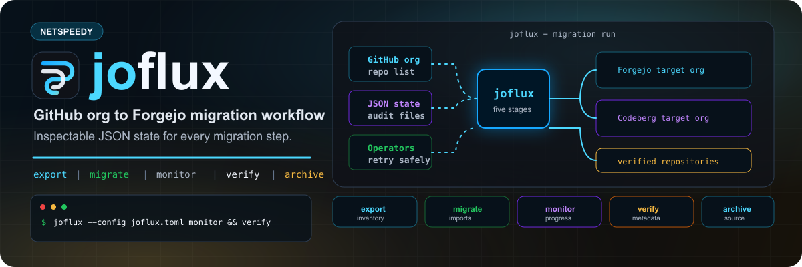

<p align="center">
  
</p>

<p align="center">
  <a href="https://github.com/netspeedy/joflux/releases"></a>
  <a href="Formula/joflux.rb"></a>
  <a href="https://github.com/netspeedy/joflux"></a>
  <a href="LICENSE"></a>
</p>

# joflux Homebrew Tap

Install [joflux](https://github.com/netspeedy/joflux) with Homebrew. joflux is
a repeatable CLI workflow for moving GitHub organization repositories to
Forgejo-compatible instances such as Codeberg.

## Install

Install the tap and formula:

```bash
brew tap netspeedy/joflux
brew install joflux
```

To verify the install:

```bash
joflux --version
joflux --help
```

For development builds from the source branch:

```bash
brew install --HEAD netspeedy/joflux/joflux
```

## Formula

The [`joflux`](Formula/joflux.rb) formula installs the latest stable release
wheel published by the main project.

## About this tap

This repository packages the Homebrew formula only. Stable releases are built in
the main [joflux](https://github.com/netspeedy/joflux) repository, then the
formula in this tap is updated automatically with the release asset URL and
SHA256 checksum.

The README hero and share-card artwork live in [`assets/`](assets/):

- [`joflux-readme-hero.png`](assets/joflux-readme-hero.png) and
  [`joflux-readme-hero.svg`](assets/joflux-readme-hero.svg) for this README.
- [`joflux-social-card.png`](assets/joflux-social-card.png) and
  [`joflux-social-card.svg`](assets/joflux-social-card.svg) for Open Graph or
  social previews that need a 1200x630 image.

## Links

- [joflux source repository](https://github.com/netspeedy/joflux)
- [joflux releases](https://github.com/netspeedy/joflux/releases)
- [Formula source](Formula/joflux.rb)

## License

Copyright (c) 2026 Simon Oakes. Released under the [MIT License](LICENSE).

joflux is an unofficial community tool. It is not affiliated with, endorsed by,
or sponsored by GitHub, Forgejo, or Codeberg.
